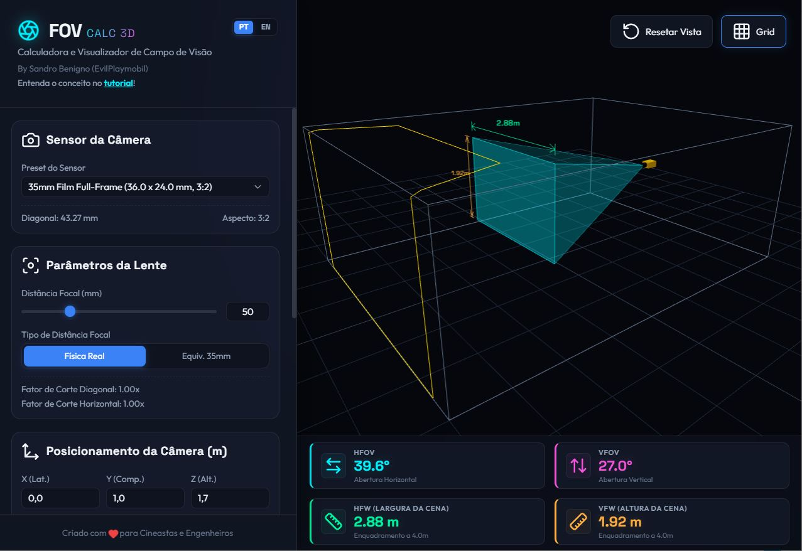

# FOVCalc 🎥📐

🇺🇸 English | 🇧🇷 [Português](README.pt-BR.md)

## 🚀 [Access the Online 3D Mathematical Framing Calculator](https://sandrobenigno.github.io/FOVCalc/)

---

## Sensor, Angle, and Mathematical Framing

You have probably heard photographers and filmmakers say things like: "Put a 35mm here" or "This 24mm on full frame is equivalent to a 16mm on Super 35".

But have you ever stopped to think about where the angle that this lens sees comes from? And more importantly: how many meters of width will you frame at a certain distance?

---

## 🎬 Demystifying HFOV and HFW

When we talk about the angle of a lens, we are generally referring to its AoV (*Angle of View*). In practice, this term is split into three: diagonal (DFOV), vertical (VFOV), and horizontal (HFOV). In this article, I will show you in a light and geometric way how to calculate HFOV (*Horizontal Field of View*) and HFW (*Horizontal Field Width*), using the crop factor or 35mm equivalence. At the end, you will have a series of tools to solve questions around these concepts on set. Let's go! 🎬

---

## 📐 Concept 1: HFOV (Horizontal Field of View)

HFOV (*Horizontal Field of View*) is the angle of view that the lens sees specifically on the horizontal axis, measured in degrees (°).

### The HFOV Formula

The first point we need to keep in mind is understanding what focal length is. It is the physical distance between the lens optical center and the sensor surface.
However, when the sensor is smaller than a 35mm frame (i.e. it is not Full Frame), the manufacturer provides the focal length in two ways:

1. **Real**: physical distance from the lens focal center to the sensor surface;
2. **35mm Equivalent**: real value multiplied by an equivalence factor.

#### But after all, what is a focal length equivalent to 35 mm?
Imagine that you took a smaller sensor and stretched it until its diagonal reached 43.2666mm, which is the diagonal of the classic 35mm film (36 x 24 mm and 3:2 aspect ratio). Consider that the lens would be stretched along with the sensor in this process. If the lens grows, the distance between its optical center and the sensor also increases. This new value is precisely what we call the 35mm equivalent focal length.

This separation is necessary for the calculations because if the focal length given is the 35mm equivalent, you will consider the sensor width as 36mm. On the other hand, if you have the real focal length value, you will use the real width of the sensor.

Now that we clarified these points, let's think about the right triangle formed inside the camera between the focal length and half of the sensor. This is what we see in the illustration below.

Observe that:

$$
{x} = \frac{\text{Sensor Width}}{2} \gets \text{ This is the opposite leg to the angle}\\
$$
$$
{z} = \text{Focal Length} \gets \text{This is the adjacent leg to the angle}
$$

Since tangent is opposite over adjacent, the angle can be calculated by the inverse of the tangent:

$$
{\alpha} = \arctan \left( \frac{x}{z} \right)
$$

And since HFOV is twice this angle, we can calculate it directly as:

$$
\text{HFOV} = 2 \times \arctan\bigg( \frac{x}{z} \bigg)
$$

This is the most direct and simple geometric form. It is the basis for calculating the angle for both Full Frame and smaller cameras. As mentioned, just use consistent values for $x$ and $z$ (both real or both equivalent). This is what we will see next, when we use the crop factor to balance both terms.

To calculate the HFOV from 35mm equivalence by camera crop factor, we use:

$$
{\text{HFOV}} = 2 \times \arctan\left( \frac{18}{\text{Focal Length} \times \text{Crop Factor}} \right)
$$

Where:
* **18** is the opposite leg, representing half of a 36mm Full Frame sensor width.
* **Crop Factor** is the number indicating how many times your sensor is smaller than Full Frame.
* The **Focal Length** multiplied by the Crop Factor is the adjacent leg (equivalent focal length).

We say that in some cases the calculation might only be an approximation, because the crop factor provided by the manufacturer is given by the diagonal difference. For precise values when the sensor aspect ratio is different from 3:2, we would need to calculate the horizontal crop factor first:

$$
C_H = C_D \times \text{Multiplier}\\
$$
$$
C_H = C_D \times \left(\frac{36}{43.266} \times \frac{\sqrt{a^2 + b^2}}{a}\right)
$$

After calculating the Horizontal Crop Factor, you can insert it into the original HFOV formula. All calculations will be geometrically precise.

For convenience, here are the most common aspect ratios, with the multiplier already calculated, to obtain the Horizontal Crop Factor:

| Aspect Ratio | Multiplier | Observation |
|--------------|------------|-------------|
| 3:2          | 1.0000     | no correction needed |
| 4:3          | 1.0399     |             |
| 16:9         | 0.9545     |             |

> [!NOTE]
> All formulas could also be used to calculate the vertical opening angle (VFOV). Just replace $x$ with $y$, keeping $z$, where $y$ would be half the sensor height instead of width.
> 
> But beware of a common mistake: do not calculate the vertical angle by applying the aspect ratio proportion directly to the horizontal angle (e.g. thinking VFOV is 3/4 of HFOV on a 4:3 sensor). Since the relationship involves trigonometry, the angles do not change linearly.
> 
> On the other hand, if you apply the aspect ratio proportion directly to the physical size of the captured scene, it works perfectly! In a 4:3 sensor, the physical height of the scene will be exactly 3/4 of the width. And this physical width calculation brings us to the next essential concept: HFW.

---

## 📏 Concept 2: HFW (Horizontal Field Width)

HFW (*Horizontal Field Width*) is the physical width of the captured scene, measured in meters. This is what really matters on set when you need to know: *"If I place the camera 5 meters from the actor, how many meters of width (HFW) will I frame?"*

### The HFW Formula

To calculate the HFW, we use a right triangle formed by the distance from the camera to the object and half the width of the scene:

Where:
* **Angle**: Half of the HFOV ($HFOV/2$).
* **Adjacent Leg**: The distance ($D$) from the camera to the object (from the lens optical center).
* **Opposite Leg**: Half of the scene width ($HFW/2$).

Using the tangent definition:

$$
\tan\left(\frac{\text{HFOV}}{2}\right) = \frac{\text{HFW}/2}{D}
$$

Isolando o HFW:

$$
\frac{\text{HFW}}{2} = D \times \tan\left(\frac{\text{HFOV}}{2}\right)
$$
$$
\text{HFW} = 2 \times D \times \tan\left(\frac{\text{HFOV}}{2}\right)
$$

---

## 🎯 Practical Example

**Situation**: You have a lens with a 35mm equivalent of 50mm, and you want to know the HFW at 4 meters distance.

* **Step 1: Calculate the HFOV**: Since the focal length value given is 50mm in 35mm equivalence, the conversion to Full Frame values is already done. Therefore, the sensor width will be 36mm. Remember: 35mm film has a frame width of 36mm. We use half the sensor for the calculation, which is 18mm. Thus, we have:

$$
\text{HFOV} = 2 \times \arctan\left( \frac{18}{50} \right) \to 2 \times 19.79° = 39.6°
$$

* **Step 2: Get the semi-angle**: We take half of the HFOV (exactly the 19.79° semi-angle found during the previous calculation):

$$
\frac{39.6°}{2} = 19.79°
$$

* **Step 3: Calculate the width (HFW)**: We calculate the width using the tangent of this angle and the distance of 4 meters:

$$
\text{HFW} = 2 \times 4 \times \tan(19.79°) \to 8 \times 0.36 = 2.87 \text{ meters}
$$

**Result**: At 4 meters distance, your framed scene will have a physical width (HFW) of approximately **2.87 meters**.

---

## 🧠 Summary to Remember

| What You Want to Know | Formula | Unit |
| --------------------- | ------- | ------- |
| **Lens horizontal angle (HFOV)** | $2 \times \arctan( \text{Half of Sensor Width} / \text{Focal Length} )$ | Degrees (°) |
| **Physical width of the scene (HFW)** | $2 \times D \times \tan( \text{HFOV} / 2 )$ | Meters (m) |

---

## 📝 Basic Sensor Table

| Type | Width (mm) | Height (mm) | Aspect Ratio | Crop Factor |
|------|------------|-------------|--------------|-------------|
| 1/10" | 1.28 | 0.96 | 4:3 | 27.04 |
| 1/8" (Sony DCR-SR68) | 1.60 | 1.20 | 4:3 | 21.65 |
| 1/6" (Panasonic SDR-H20) | 2.40 | 1.80 | 4:3 | 14.14 |
| 1/4" | 3.60 | 2.70 | 4:3 | 10.81 |
| 1/3.6" (Nokia Lumia 720) | 4.00 | 3.00 | 4:3 | 8.65 |
| 1/3.2" (iPhone 5) | 4.54 | 3.42 | 4:3 | 7.61 |
| **35 mm film full-frame** | **36.00** | **24.00** | **3:2** | **1.00** |
| IMAX film frame | 70.41 | 52.63 | 4:3 | 0.49 |
| Large-format 8×10 inch | 254.00 | 203.00 | 5:4 | 0.143 |
