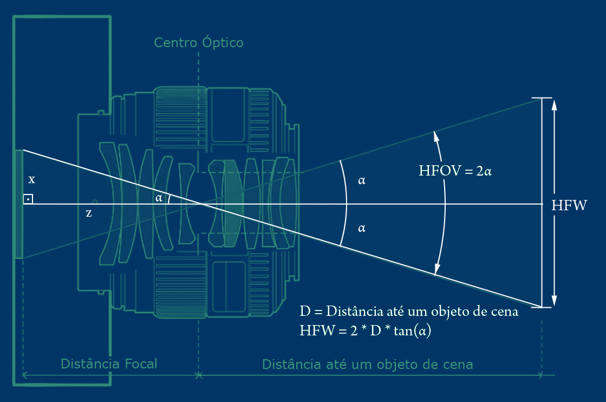
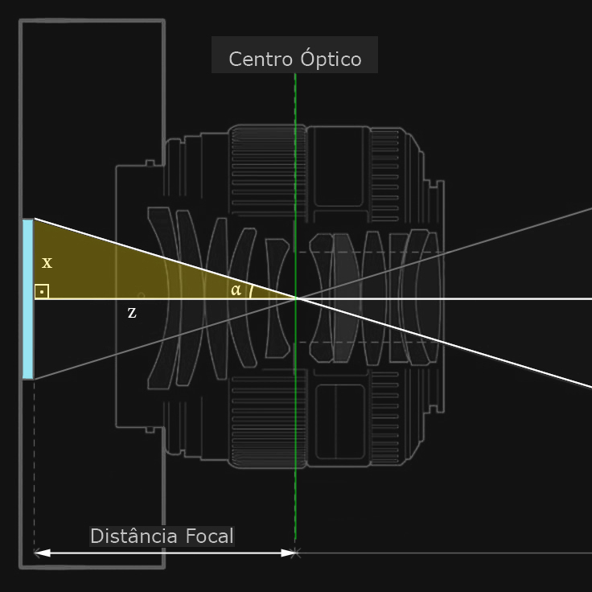
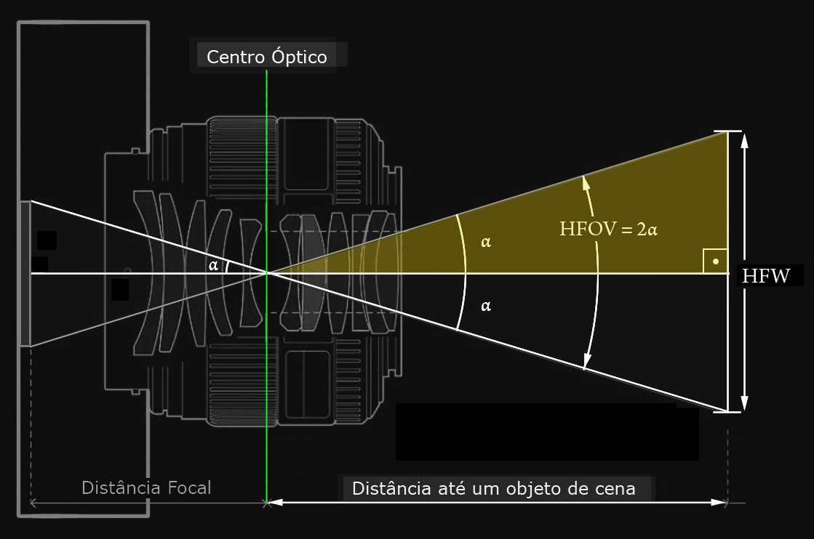

# HFOVCalc

## Sensor, Ângulo e Enquadramento Matemático

Você já deve ter ouvido fotógrafos e filmakers dizendo frases como: "Coloca uma 35mm aqui" ou "Essa 24mm no full frame equivale a uma 16mm no Super 35".

Mas você já parou para pensar de onde vem o número do ângulo que essa lente enxerga? E mais importante: quantos metros de largura você vai enquadrar a uma certa distância?

## 🎬 Desvendando HFOV e HFW

Quando falamos sobre o ângulo de uma lente, estamos nos referindo genericamente ao seu AoV (Angle of View). Na prática, esse termo se divide em três: o diagonal (DFOV), o vertical (VFOV) e o horizontal (HFOV). Neste artigo, vou te mostrar de forma leve e geométrica como calcular o HFOV (Horizontal Field of View) e o HFW (Horizontal Field Width), usando o fator de corte ou a equivalência de 35mm. No final, você terá uma série de ferramentas para resolver questões em torno desses conceitos no set. Vamos lá! 🎬

## 📐 Conceito 1: HFOV (Ângulo de Visão Horizontal)

O HFOV (Horizontal Field of View) é o ângulo de visão que a lente enxerga especificamente na horizontal, medido em graus (°).

A Fórmula do HFOV

O primeiro ponto que precisamos ter em mente é a compreensão do que é distância focal. Ela é a distância entre o centro óptico da lente e a superfície do sensor.
Porém, quando o sensor é menor que um fotograma de 35mm, ou seja, não é Full Frame, o fabricante fornece a distância focal de duas formas:

Real (que é a distância física do centro focal da lente até a superfície do sensor);

Equivalente a 35mm (valor real multiplicado por um fator de equivalência).

Mas, afinal, o que é uma distância focal equivalente a 35 mm?
Imagine que você pegou um sensor menor e o esticou até que sua diagonal atingisse 43,2666mm, que é a diagonal do clássico filme de 35 mm (36 x 24 mm e aspecto 3:2). Considere que a lente seria esticada junto com o sensor nesse processo. Se a lente cresce, a distância entre o centro óptico dela e o sensor também aumenta, não é mesmo? Pois é exatamente esse novo valor que chamamos de distância focal equivalente a 35 mm.

Essa separação é necessária para os cálculos, pois, caso a distância focal dada for o equivalente a 35mm, você irá considerar a largura do sensor como 36mm. Por outro lado, se você tem o valor da distância focal real, irá valer-se da largura real do sensor.

Agora que esclarecemos esses pontos, vamos pensar no triângulo retângulo que é formado dentro da câmera, entre a distância focal e metade do sensor. Isso é o que vemos na ilustração abaixo.

Observe que:

$$
{x} = \frac{\text{Largura do Sensor}}{2} \gets \text{ É o cateto oposto ao ângulo}\\
$$
$$
{z} = \text{Distância Focal} \gets \text{É o cateto adjacente ao ângulo}
$$

Como a tangente é o cateto oposto sobre o adjacente, o ângulo pode ser calculado pelo inverso da tangente:

$$
{\alpha} = \arctan \left( \frac{x}{z} \right)
$$

E sendo o HFOV o dobro desse ângulo, podemos calcular direto como:

$$
\text{HFOV} = 2 \times \arctan\bigg( \frac{x}{z} \bigg)
$$

Essa é a forma geométrica mais direta e simples. Ela é a base para se calcular o ângulo, tanto para câmeras com lentes e sensores Full Frame quanto para lentes e sensores menores. Como já dissemos, basta usar valores coerentes para x e z , ou seja, ambos reais ou ambos equivalentes. É o que veremos em seguida, quando utilizamos o fator de corte para equilibrar os dois termos.

Para calcular o HFOV a partir da equivalência de 35mm por fator de corte da câmera, usamos:

$$
{\text{HFOV}} = 2 \times \arctan\left( \frac{18}{\text{Distância Focal} \times \text{Fator de Corte}} \right)
$$

Onde:

18 é o cateto oposto, com a metade da Largura de um Sensor de 36mm (Full Frame).

Fator de Corte = número que indica quantas vezes seu sensor é menor que o Full Frame.

A Distância Focal multiplicada pelo Fator de Corte é o cateto adjacente. A multiplicação transforma a distância focal em seu valor equivalente  em 35mm (ou aproximado, para aspectos diferentes de 3:2). 

Dizemos que em alguns casos o cálculo pode ser apenas aproximado, porque o fator de corte fornecido pelo fabricante é dado pela diferença diagonal entre o sensor real e o sensor de referência (36x24mm e aspecto 3:2). Para valores precisos, naqueles casos em que o aspecto do sensor real é diferente de 3:2, precisaríamos primeiro calcular o fator de corte horizontal para, depois, utilizá-lo na fórmula acima.

Reforçando, isso ocorre porque o fator de corte horizontal muda quando o aspecto do sensor não é 3:2 como são os de 35mm. Ou seja, os fatores de corte diagonal, horizontal ou mesmo o vertical serão diferentes entre si, quando o aspecto é 4:3, 16:9, etc. Quando esse for o caso, e você quiser trabalhar com precisão, calcule primeiro o fator de corte horizontal (CH), em função do fator diagonal dado (CD) e do aspecto do sensor dado (a:b), aplicando os seus respectivos valores na fórmula abaixo:

$$
C_H = C_D \times \text{Multiplicador}\\
$$
$$
C_H = C_D \times \left(\frac{36}{43,266} \times \frac{\sqrt{a^2 + b^2}}{a}\right)
$$

Após calculado o Fator de Corte Horizontal, pode inseri-lo na fórmula original do HFOV. Todos os dados estarão geometricamente precisos.

Para facilitar, segue abaixo os valores mais comuns de aspecto, com o multiplicador já calculado, para obter o Fator de Corte Horizontal:

| Aspecto | Multiplicador | Observação |
|---------|---------------|------------|
| 3:2     | 1.0000        | não precisa corrigir |
| 4:3     | 1.0399        |            |
| 16:9    | 0.9545        |            |

💡 Todas as fórmulas poderiam ser utilizadas também para calcular o ângulo de abertura vertical (VFOV). Bastaria substituir x por y, mantendo z. Onde y seria a metade da altura do sensor, em vez da largura. Mas atenção a um erro comum: você não deve calcular o ângulo vertical aplicando a proporção do aspecto direto no ângulo horizontal (por exemplo, achar que o VFOV é 3/4 do HFOV em um sensor 4:3). Como a relação envolve trigonometria, os ângulos não mudam de forma linear. Por outro lado, se você aplicar a proporção do aspecto diretamente no tamanho físico da cena capturada, a regra funciona perfeitamente! Em um sensor 4:3, a altura real da cena será exatamente 3/4 da largura. E é justamente esse cálculo da largura física da cena que nos leva ao nosso próximo conceito essencial para o set: o HFW.

## 📏 Conceito 2: HFW (Largura Física do Campo de Visão Horizontal)

O HFW (Horizontal Field Width) é a largura física da cena capturada, medida em metros. É o que realmente importa no set quando você precisa saber: "Se eu colocar a câmera a 5 metros do ator, quantos metros de largura (HFW) vou enquadrar?"

A Fórmula do HFW

Para calcular o HFW, usamos um triângulo retângulo formado pela distância da câmera até o objeto e a metade da largura da cena:

Onde:

Ângulo: A metade do HFOV (HFOV/2).

Cateto Adjacente ao ângulo: A distância (D) da câmera até o objeto (a partir do centro óptico da lente).

Cateto Oposto ao ângulo: A metade da largura da cena (HFW/2).

Usando a definição da tangente:

$$
\tan\left(\frac{\text{HFOV}}{2}\right) = \frac{\text{HFW}/2}{D}
$$

Isolando o HFW:

$$
\frac{\text{HFW}}{2} = D \times \tan\left(\frac{\text{HFOV}}{2}\right)
$$
$$
\text{HFW} = 2 \times D \times \tan\left(\frac{\text{HFOV}}{2}\right)
$$

## 🎯 Exemplo Prático

Situação: Você está com uma lente cuja equivalência em 35mm é de 50mm, e quer saber quantos metros de largura (HFW) vai enquadrar a 4 metros de distância.

Passo 1: Vamos calcular o HFOV. Se o valor de distância focal dado é de 50mm em equivalência a 35mm, a conversão para valores em Full Frame já foi feita. Portanto, a largura do sensor será 36mm. Pois, lembre-se: um filme de 35mm tem a largura do fotograma igual a 36mm. Nós utilizamos a metade do sensor para o cálculo, ou seja, 18mm. Assim, teremos:

$$
\text{HFOV} = 2 \times \arctan\left( \frac{18}{50} \right) \to 2 \times 19,79° = 39,6°
$$

Passo 2: Para o cálculo do HFW, tomaremos a metade do HFOV (exatamente o semiângulo 19,7° encontrado no meio do cálculo anterior):

$$
\frac{39,6°}{2} = 19,79°
$$

Passo 3: Calculamos a largura (HFW) usando a tangente desse ângulo e a distância de 4 metros:

$$
\text{HFW} = 2 \times 4 \times \tan(19,79°) \to 8 \times 0,36 = 2,87 \text{ metros}
$$

Resultado: A 4 metros de distância, sua cena enquadrada terá uma largura física (HFW) de aproximadamente 2,87 metros.

##

## 🧠 Resumo para Lembrar

| O Que Você Quer Saber | Fórmula | Unidade |
| --------------------- | ------- | ------- |
| **Ângulo horizontal da lente** | (HFOV)2 × arctan( Metade da Largura do Sensor / Distância Focal ) | Graus (°) |
| **Largura física da cena** | (HFW)2 × D × tan( HFOV / 2 ) | Metros (m) |

##

## 📝 Tabela Básica de Sensores

| Tipo | Largura (mm) | Altura (mm) | Aspecto | Fator de Corte |
|------|--------------|-------------|---------|----------------|
| 1/10" | 1.28 | 0.96 | 4:3 | 27.04 |
| 1/8" (Sony DCR-SR68) | 1.60 | 1.20 | 4:3 | 21.65 |
| 1/6" (Panasonic SDR-H20) | 2.40 | 1.80 | 4:3 | 14.14 |
| 1/4" | 3.60 | 2.70 | 4:3 | 10.81 |
| 1/3.6" (Nokia Lumia 720) | 4.00 | 3.00 | 4:3 | 8.65 |
| 1/3.2" (iPhone 5) | 4.54 | 3.42 | 4:3 | 7.61 |
| **35 mm film full-frame** | **36.00** | **24.00** | **3:2** | **1.00** |
| IMAX film frame | 70.41 | 52.63 | 4:3 | 0.49 |
| Large-format 8×10 inch | 254.00 | 203.00 | 5:4 | 0.143 |
